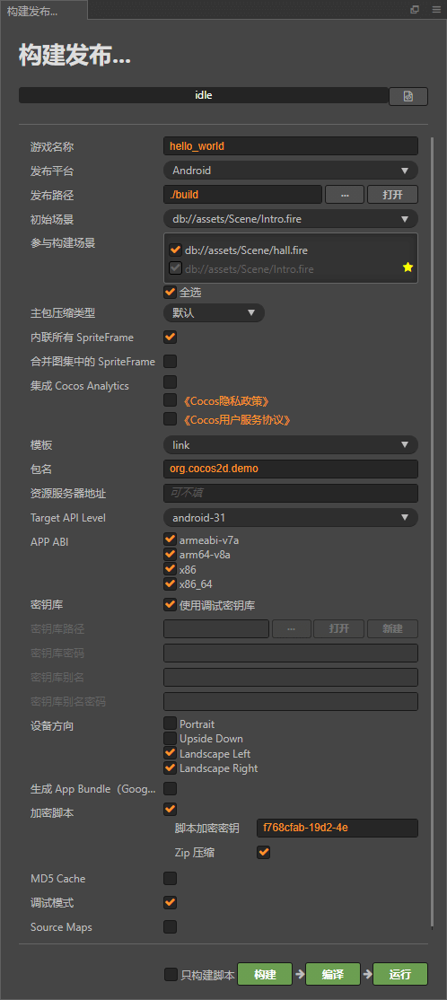

# 2.4.x bundle 大厅子游戏单独热更新

## 【请不要下载项目后立即用 Cocos Creator 打开项目 ！！】

## 【请按照运行指引运行项目 ！！】

## 【此项目基于 Cocos Creator 2.4.9，理论上支持所有 2.4.x 版本】

## 需定制引擎以支持子游戏脚本热加载
- 方法一（定制js引擎从2.4.9版本迁移出只保证2.4.9版本正常使用）
	- 打开编辑器
	- 项目->项目设置->自定义引擎
	- 去掉使用内置的JavaScript引擎勾选
	- 选择项目中的customEngine
	- 重启编辑器
- 方法二（建议使用）:
	- 点击编辑器右上角`编辑器按钮`，或者直接找到引擎安装路径
	- 找到构建缓存`引擎版本/resources/engine/bin/.cache`，删除对应平台构建缓存
	- 找到文件`引擎版本/resources/engine/cocos2d/core/platform/js.js`
	- 找到`function setup`方法替换如下

```
function setup (key, publicName, table) {
        js.getset(js, publicName,
            function () {
                return Object.assign({}, table);
            },
            function (value) {
                js.clear(table);
                Object.assign(table, value);
            }
        );
        return function (id, constructor) {
            // deregister old
            if (constructor.prototype.hasOwnProperty(key)) {
                delete table[constructor.prototype[key]];
            }
            js.value(constructor.prototype, key, id);
            // register class
            if (id) {
                var registered = table[id];
// ---------------------------- 旧逻辑 start ----------------------------
//                 if (registered && registered !== constructor) {
//                     var error = 'A Class already exists with the same ' + key + ' : "' + id + '".';
//                     if (CC_TEST) {
//                         error += ' (This may be caused by error of unit test.) \
// If you dont need serialization, you can set class id to "". You can also call \
// cc.js.unregisterClass to remove the id of unused class';
//                     }
//                     cc.error(error);
//                 }
//                 else {
//                     table[id] = constructor;
//                 }
// ---------------------------- 旧逻辑 end ----------------------------
// ---------------------------- 新逻辑 start ----------------------------
                if (registered && registered !== constructor) {
                    if (key == "__classname__") {
                        delete _nameToClass[id];
                    } else if (key == "__cid__") {
                        delete _idToClass[id];
                    }
                    // console.log(`---- cc.js.setup ---- delete ${key} : ${id}`);
                }
                table[id] = constructor;
// ---------------------------- 新逻辑 end ----------------------------
                //if (id === "") {
                //    console.trace("", table === _nameToClass);
                //}
            }
        };
    }
```


# 亮点介绍

1. 大厅、子游戏分离，子游戏分包下载

1. 新增游戏无需更新包体，新增配置即可

1. 简洁易懂，界面化操作

# 关键目录结构、文件简介

```js
|-- assets
    |-- resources
        |-- manifest    // 项目manifest文件存放目录
    |-- Script
        |-- hotUpdate
            |-- HotUpdateEvent.ts   // 热更新事件
            |-- MainHotUpdate.ts    // 主包热更新脚本
            |-- SubGameHotUpdate.ts // 子游戏热更新脚本
            |-- VersionTool.ts      // 版本工具
        |-- subGame
            |-- SubGameCtrl.ts      // 子游戏控制器
            |-- SubGameInterface.ts // 子游戏接口相关
            |-- SubGameMgr.ts       // 子游戏管理器
        |-- BackHall.ts         // 回大厅统一脚本
        |-- GameConst.ts        // 游戏常理存放
        |-- HallSceneCtrl.ts    // 大厅场景控制脚本
        |-- Intro.ts            // 初始化脚本（同时也挂载在Intro场景）
|-- hot-update-packages // 热更包目录
    |-- manifest
    |-- server      // 本地服务器根目录，远程服务器目录结构可参考此目录
        |-- ...     // 生成热更后，会复制一份至该目录，所以此处热更包永远是最新的
        |-- http-server         //mac http-server 执行文件
        |-- http-server.bat     //windows http-server 执行文件
        |-- subGameConfig.json  // 子游戏配置
    |-- versions    // 存放历史各个版本热更包
|-- packages
    |-- hot-update-tools    // 热更插件目录
```

# 运行指引

## 一、初始化

1. 进入 [热更插件目录](./packages/hot-update-tools/) 执行 `npm i` 命令进行初始化插件

## 二、运行（以 android 为例）

1. 使用 `Cocos Creator 2.4.9` 打开该项目

1. 服务器

    1. 使用本地服务器

        - 下载[nodejs](http://nodejs.cn/)并安装，windows 可能需要配置好环境变量
        - 执行 cmd 命令 `npm i http-server -g` 安装 http-server，mac用户要用sudo安装
        - windows 用户执行[脚本](./hot-update-packages/server/http-server.bat)
        - mac 用户执行[脚本](./hot-update-packages/server/http-server)
        - 替换 [GameConst.ts](./assets/Script/GameConst.ts) 中的`ip`为自己设备`ip`
        - 替换 [subGameConfig.json](./hot-update-packages/server/subGameConfig.json) 中的`ip`为自己设备`ip`

    1. 使用远程服务器查看 [GameConst.ts](./assets/Script/GameConst.ts) 中的 `server_ip` 引用自行修改逻辑

1. 构建项目【项目->构建发布->发布平台选 android->配置参照以下->构建】谨记`不要勾选MD5`

1. 热更插件操作

    1. 打开热更插件【项目->热更新工具】,打开后热更工具会进行初始化

    1. 修改资源服务器 url

    1. 检查主包配置、子游戏配置。缺少子游戏，请检查是否配置了 bundle，配置好后 点击`刷新子游戏按钮`，点击下拉菜单，选择对应子游戏后，配置好后点击`添加配置按钮`

    1. 点击`生成热更包按钮`，如果子游戏很多，文件很多，可能会有延时，如无报错，等待即可

    1. 点击导入`manifest按钮`

1. 构建项目【项目->构建发布->构建】

1. 点击热更插件中的`生成热更包按钮`会自动删除不在包内的子游戏文件夹，以及对config、index进行版本标识

1. 编译

    1. [配置原生开发环境](https://docs.cocos.com/creator/2.4/manual/zh/publish/setup-native-development.html)

    1. cocos 自带

        1. 编译项目【项目->构建发布->编译】

        1. 安装 apk(一般在 `[项目目录]\build\jsb-link\frameworks\runtime-src\proj.android-studio\app\build\outputs\apk\debug` )

    1. android studio 自行搜索教程

1. 运行, 如果成功运行，如下，点击 game2 会进行下载，下载完成后点击即可运行

# 添加游戏指引（以本地服务器为例）

1. 添加游戏文件夹，`配置为bundle`，在文件夹中新建`与bundle同名启动场景`，之所以同名详见[子游戏启动逻辑](./assets/Script/subGame/SubGameMgr.ts)，如有需要可修改改逻辑

1. 构建项目【项目->构建发布->构建】

1. 添加热更配置

    1. 打开热更工具面板

    1. 点击`刷新子游戏按钮`，`下拉栏选择`刚刚添加的子游戏，去掉包内勾选，点击`添加配置按钮`

1. 点击`生成热更包按钮`，如果子游戏很多，文件很多，可能会有延时，如无报错，等待即可

1. 服务器

    1. 使用本地服务器无需任何操作

    1. 使用远程服务器需要把最新版本替换至远程服务器

1. [服务器配置](./hot-update-packages/server/subGameConfig.json)中添加新子游戏配置

1. 重启 app，或者点击其中一个子游戏后回到大厅，成功如下，点击 game3 会进行下载，下载完成后点击即可运行

# 主包更新指引

1. 修改主包中 hall 场景内容，比如修改为 hall1

1. 构建项目【项目->构建发布->构建】

1. 主包配置中的热更版本+1

1. 点击`生成热更包按钮`，如果子游戏很多，文件很多，可能会有延时，如无报错，等待即可

1. 服务器

    1. 使用本地服务器无需任何操作

    1. 使用远程服务器需要把最新版本替换至远程服务器

1. 重启 app，运行如下

# 子包更新指引

1. 修改子包中 game1 场景内容，比如修改为 game11

1. 构建项目【项目->构建发布->构建】

1. 子包 game1 配置中的热更版本+1

1. 点击`生成热更包按钮`，如果子游戏很多，文件很多，可能会有延时，如无报错，等待即可

1. 服务器

    1. 使用本地服务器无需任何操作

    1. 使用远程服务器需要把最新版本替换至远程服务器

1. 重启 app，或者点击其中一个子游戏后回到大厅，成功如下，点击 game1 会进行下载，下载完成后点击即可运行

# 注意事项!!!!

1. 子游戏命名（文件夹名/bundle 名）最好不要包含特殊符号，否则可能导致启动失败

1. 构建时请不要勾选 MD5

1. 编译前切记删除构建目录下`[项目目录]\build\jsb-link\assets`，`不在包内`的子游戏文件夹。

1. 添加游戏务必配置为 bundle

1. bundle 间尽量避免相互引用，公共资源放在主包中
